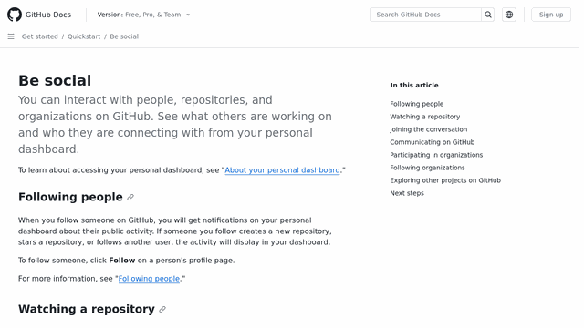

# website-to-gif [](https://github.com/PabloLec/website-to-gif/releases/) [](https://github.com/PabloLec/website-to-gif/blob/main/LICENSE)


<p align="center">
    
</p>
<p align="center">
    <b>This Github Action automatically creates a animated GIF or WebP from a given web page to display on your project README (or anywhere else).</b>
</p>

## Usage


In your GitHub repo, create a workflow file or extend an existing one. (e.g. `.github/workflows/gif.yml`)

You have to also include a step to `checkout` and commit to the repo.
You can use the following example `gif.yml`. Make sure to modify the `url` value and add any other [input](#Inputs) you want to use.

`.github/workflows/gif.yml`
``` yaml
name: Generate demo file

on: push

jobs:
  generate-gif:
    runs-on: ubuntu-latest
    steps:
      - uses: actions/checkout@v3
      - name: Website to file
        uses: PabloLec/website-to-gif@2.1.1
        with:
          url: "https://docs.github.com/en/get-started"
      - name: Commit file to GH repo
        run: |
          git config --global user.name "PabloLec/website-to-gif"
          git config --global user.email "action@github.com"
          git add .
          git commit -m 'Update file'
          git push
```

See [official GitHub doc](https://docs.github.com/en/actions/reference/workflow-syntax-for-github-actions) to further customize your workflow.

## Inputs

| Name                 | Description                                                                                                                   | Default         | Example                          |
|----------------------|-------------------------------------------------------------------------------------------------------------------------------|-----------------|----------------------------------|
| url                  | Web page URL to be captured. **Required**                                                                                                   |                 | `url: "https://docs.github.com"` |
| save_path            | File saving path, starts with `/`. Make sure the path you provide already exists as this action will not create any directory. | repo root       | `save_path: "/docs/images/"`     |
| file_format          | Output file format, currently support GIF and WebP                                                                             | GIF             | `file_format: "WebP"`            |
| file_name            | File name, **do not include extension or path**                                                                                | demo            | `file_name: "ss_25_tps_100"`     |
| window_width         | Browser window width                                                                                                          | 1920 (px)       | `window_width: 1366`             |
| window_height        | Browser window height                                                                                                         | 1080 (px)       | `window_height: 768`             |
| stop_y               | Position where file capture should stop                                                                                       | bottom of page  | `stop_y: 800`                    |
| start_y              | Position where file capture should start                                                                                      | 0 (px)          | `start_y: 1024`                  |
| final_width          | Final file width                                                                                                              | 640 (px)        | `final_width: 1024`              |
| final_height         | Final file height                                                                                                             | 360 (px)        | `final_height: 576`              |
| scroll_step          | Number of pixels by scroll                                                                                                    | 25 (px)         | `scroll_step: 50`                |
| time_per_frame       | Milliseconds per frame                                                                                                        | 100 (ms)        | `time_per_frame: 200`            |
| start_delay          | Number of milliseconds to wait for before starting capture                                                                    | 0 (ms)          | `start_delay: 100`               |
| no_scoll             | Capture GIF without page scroll, will discard any scroll related parameter                                                    | false           | `no_scoll: true`                 |
| time_between_frames  | Number of milliseconds between frame captures if no_scroll is true                                                            | 100 (ms)        | `time_between_frames: 200`       |
| number_of_frames     | Number of frames to be captured if no_scroll is true                                                                           | 20              | `number_of_frames: 50`           |
| resizing_filter      | Filter used to resize frames, see https://pillow.readthedocs.io/en/stable/reference/Image.html?highlight=resize#PIL.Image.Image.resize | LANCZOS         | `resizing_filter: "LANCZOS"`     |

## Examples

Increase or decrease `scroll_step` and `time_per_frame` to modify file rendering and filesize.

#### `scroll_step: 15` `time_per_frame: 80`

#### `scroll_step: 25` `time_per_frame: 100`

#### `scroll_step: 50` `time_per_frame: 50`

#### `scroll_step: 50` `time_per_frame: 100`

#### `scroll_step: 50` `time_per_frame: 200`


You can also capture pages without scrolling

#### `no_scoll: true` `time_per_frame: 100` `time_between_frames: 100` `number_of_frames: 50`


## WebP

WebP rendering will take **a lot** of time to benefit from lossless quality and file size optimization.

## Contributing

Feel free to contribute!
To suggest a new feature, report a bug or offer your help, simply open a new [issue](https://github.com/PabloLec/website-to-gif/issues).
