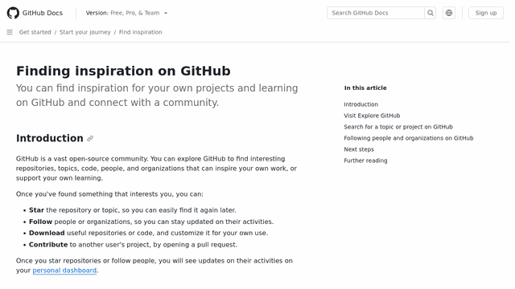

# website-to-gif [](https://github.com/PabloLec/website-to-gif/releases/) [](https://github.com/PabloLec/website-to-gif/blob/main/LICENSE)


<p align="center">
    
</p>
<p align="center">
    <b>This Github Action automatically creates a animated GIF or WebP from a given web page to display on your project README (or anywhere else).</b>
</p>

## Usage


In your GitHub repo, create a workflow file or extend an existing one. (e.g. `.github/workflows/gif.yml`)

You have to also include a step to `checkout` and commit to the repo.
You can use the following example `gif.yml`. Make sure to modify the `url` value and add any other [input](#Inputs) you want to use.

`.github/workflows/gif.yml`
``` yaml
name: Generate demo file

on: push

jobs:
  generate-gif:
    runs-on: ubuntu-latest
    steps:
      - uses: actions/checkout@v2
      - name: Website to file
        uses: PabloLec/website-to-gif@2.0.0
        with:
          url: "https://docs.github.com/en/get-started"
      - name: Commit file to GH repo
        run: |
          git config --global user.name "PabloLec/website-to-gif"
          git config --global user.email "action@github.com"
          git add .
          git commit -m 'Update file'
          git push
```

See [official GitHub doc](https://docs.github.com/en/actions/reference/workflow-syntax-for-github-actions) to further customize your workflow.

## Inputs

#### `url` *mandatory*

Web page URL to be captured.  
| *e.g:* `url: "https://docs.github.com/en/get-started"`

#### `save_path` optional

File saving path, starts with `/`,
Make sure the path you provide already exists as this action will not create any directory.  
| **defaults to repo root**.*e.g:* `save_path: "/docs/images/"`

#### `file_format` optional

Output file format, currently support GIF and WebP  
| **defaults to 'GIF'**. *e.g:* `file_format: "WebP"`

#### `file_name` optional

File name, **do not include extension or path**  
| **defaults to 'demo'**. *e.g:* `file_name: "ss_25_tps_100.gif"`

#### `window_width` optional

Browser window width  
| **defaults to 1920 (px)**. *e.g:* `window_width: 1366`

#### `window_height` optional

Browser window height  
| **defaults to 1080 (px)**. *e.g:* `window_height: 768`

#### `stop_y` optional

Position where file capture should stop  
| **defaults to bottom of page**. *e.g:* `stop_y: 800`

#### `start_y` optional

Position where file capture should start  
| **defaults to 0 (px)**. *e.g:* `start_y: 1024`

#### `final_width` optional

Final file width  
| **defaults to 640 (px)**. *e.g:* `final_width: 1024`

#### `final_height` optional

Final file height  
| **defaults to 360 (px)**. *e.g:* `final_height: 576`

#### `scroll_step` optional

Number of pixels by scroll  
| **defaults to 25 (px)**. *e.g:* `scroll_step: 50`

#### `time_per_frame` optional

Milliseconds per frame  
| **defaults to 100 (ms)**. *e.g:* `time_per_frame: 200`

#### `resizing_filter` optional

Filter used to resize frames, see https://pillow.readthedocs.io/en/stable/reference/Image.html?highlight=resize#PIL.Image.Image.resize  
| **defaults to LANCZOS**. *e.g:* `resizing_filter: "LANCZOS"`

## Examples

Increase or decrease `scroll_step` and `time_per_frame` to modify file rendering and filesize.

#### `scroll_step: 15` `time_per_frame: 80`

#### `scroll_step: 25` `time_per_frame: 100`

#### `scroll_step: 50` `time_per_frame: 50`

#### `scroll_step: 50` `time_per_frame: 100`

#### `scroll_step: 50` `time_per_frame: 200`


## WebP

WebP rendering will take **a lot** of time to benefit from lossless quality and file size optimization.

## Contributing

Feel free to contribute!
To suggest a new feature, report a bug or offer your help, simply open a new [issue](https://github.com/PabloLec/website-to-gif/issues).
