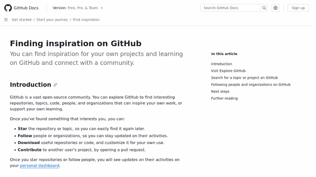

# website-to-gif [](https://github.com/PabloLec/website-to-gif/releases/) [](https://github.com/PabloLec/website-to-gif/blob/main/LICENCE) 


<p align="center">
    
    <b>This Github Action automatically creates a GIF from a given web page to display on your project README (or anywhere else).</b>
</p>

## Usage


In your GitHub repo, create a workflow file or extend an existing one. (e.g. `.github/workflows/gif.yml`)

You have to also include `checkout` and commit to the repo.
You can use the following example `gif.yml`. Make sure to modify the `url` value and add any other [input](#Inputs) you want to use.
``` yaml
name: Generate demo GIF

on: push

jobs:
  generate-gif:
    runs-on: ubuntu-latest
    steps:
      - uses: actions/checkout@v2
      - name: Website to GIF
        uses: PabloLec/website-to-gif@1.0.0
        with:
          url: "https://docs.github.com/en/get-started"
      - name: Commit GIF to GH repo
        run: |
          git config --global user.name "PabloLec/website-to-gif"
          git config --global user.email "action@github.com"
          git add .
          git commit -m 'Update GIF'
          git push
```

## Inputs

#### `url` *mandatory*

Web page URL to be captured.
*e.g:* `url: "https://docs.github.com/en/get-started"`

#### `save_path` *optional*

GIF saving path, starts with `/`, **defaults to repo root**.
*e.g:* `save_path: "/docs/images/"`

#### `gif_name` *optional*

GIF file name, do not include extension or path, **defaults to 'demo'**.
*e.g:* `gif_name: "ss_25_tps_100.gif"`

#### `window_width` *optional*

Browser window width, **defaults to 1920 (px)**.
*e.g:* `window_width: 1366`

#### `window_height` *optional*

Browser window height, **defaults to 1080 (px)**.
*e.g:* `window_height: 768`

#### `stop_y` *optional*

Position where GIF capture should stop, **defaults to bottom of page**.
*e.g:* `stop_y: 800`
#### `start_y` *optional*

Position where GIF capture should start, **defaults to 0 (px)**.
*e.g:* `start_y: 1024`
#### `final_width` *optional*

description: Final GIF width, **defaults to 640 (px)**.
*e.g:* `final_width: 1024`
#### `final_height` *optional*

Final GIF height, **defaults to 360 (px)**.
*e.g:* `final_height: 576`
#### `scroll_step` *optional*

Number of pixels by scroll, **defaults to 25 (px)**.
*e.g:* `scroll_step: 50`
#### `time_per_frame` *optional*

description: Milliseconds per frame, **defaults to 100 (ms)**.
*e.g:* `time_per_frame: 200`
#### `quality` *optional*

Image quality, from 0 to 100, **defaults to 95 (%)**.
*e.g:* `quality: 70`

## Examples

Increase or decrease `scroll_step` and `time_per_frame` to modify GIF rendering and size.

#### `scroll_step: 25` `time_per_frame: 100` *912KB*


#### `scroll_step: 50` `time_per_frame: 50` *465KB*

#### `scroll_step: 50` `time_per_frame: 100` *465KB*

#### `scroll_step: 50` `time_per_frame: 200` *465KB*

